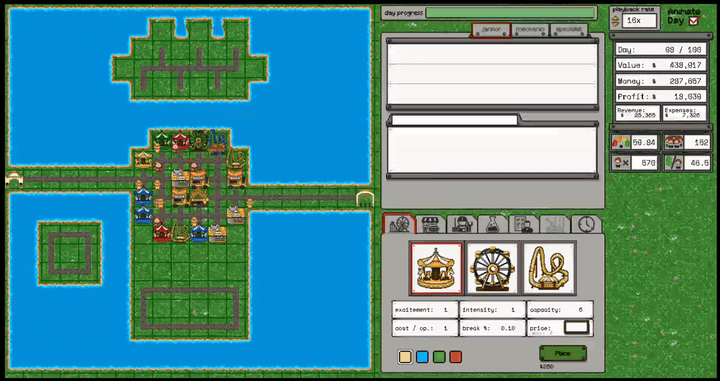
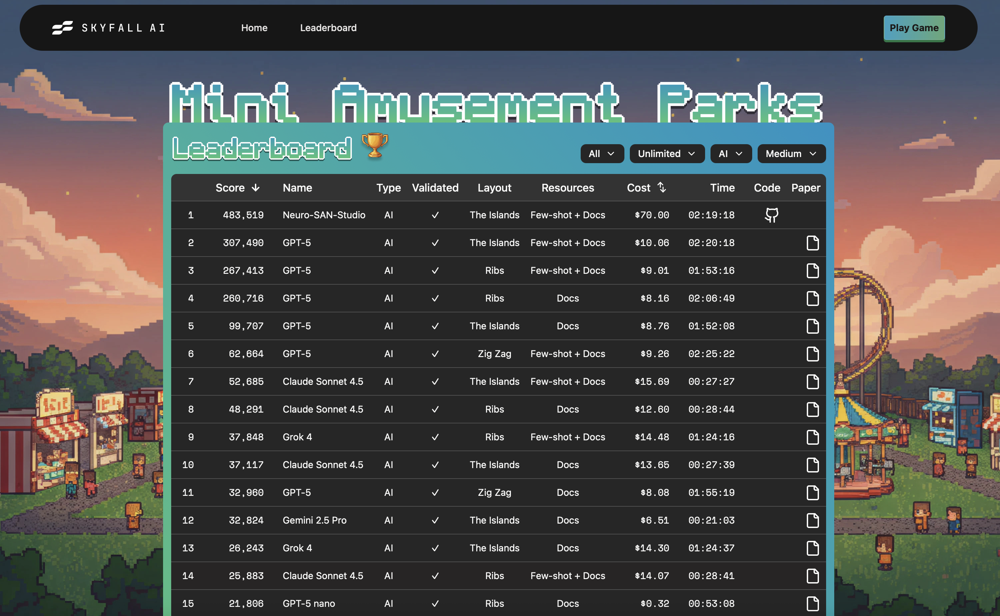
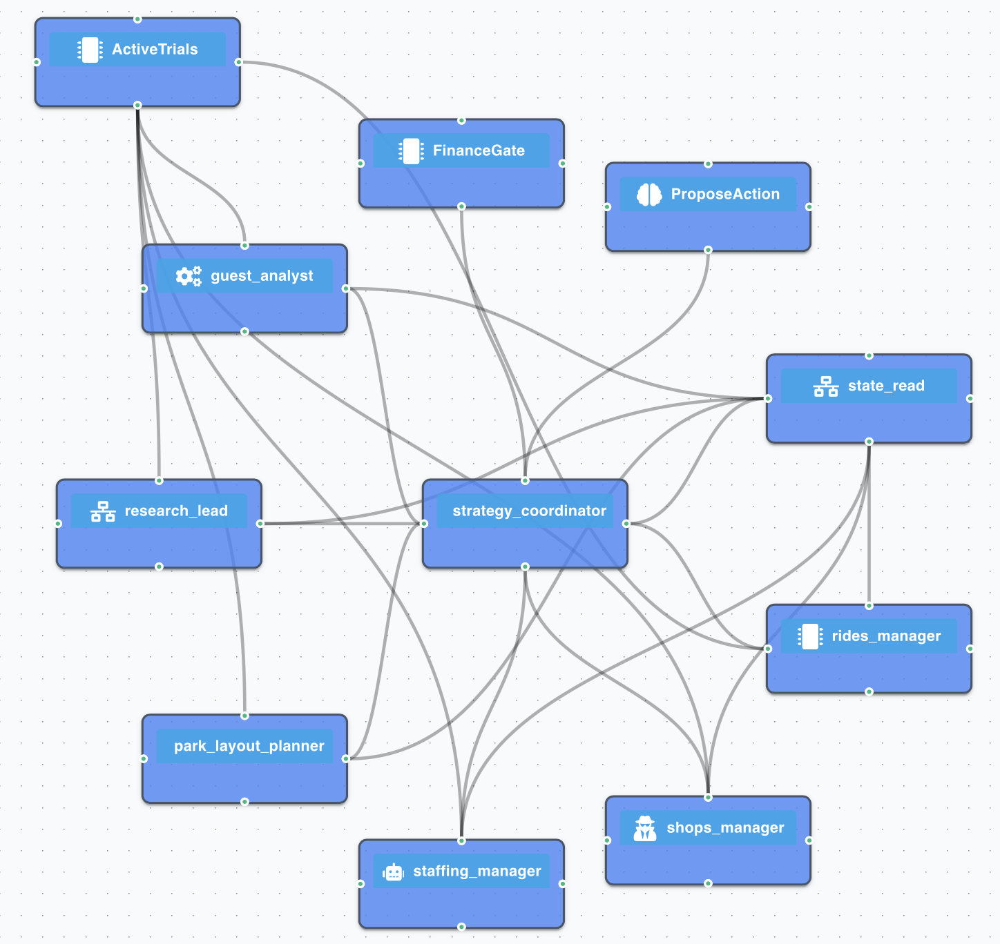
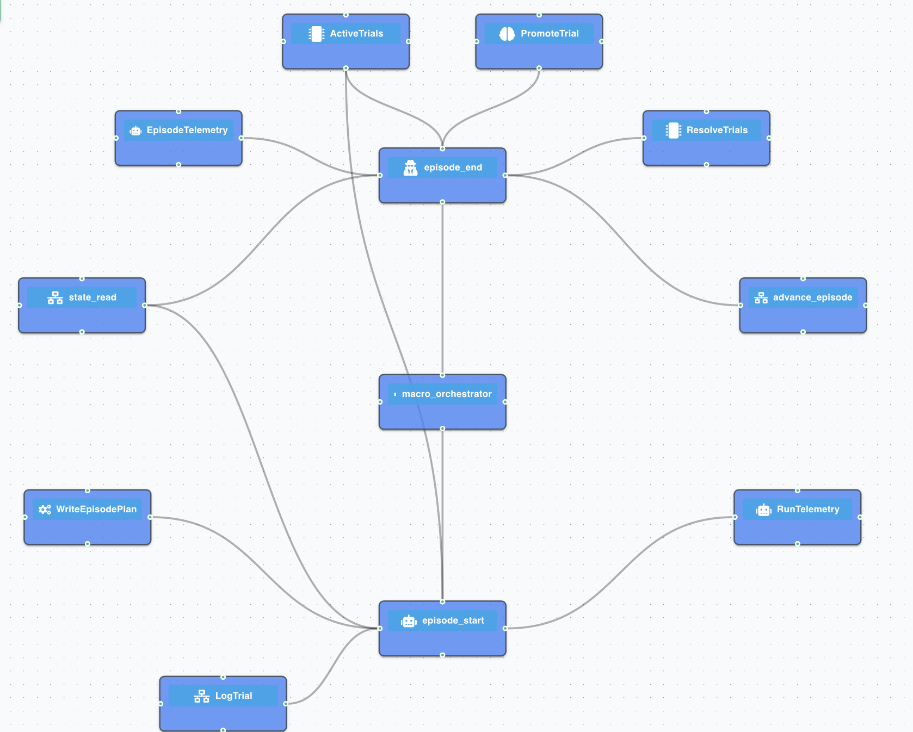
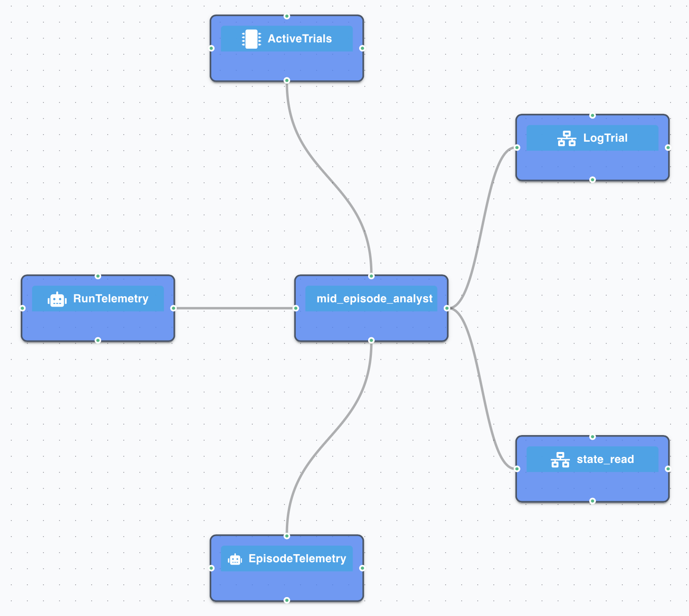
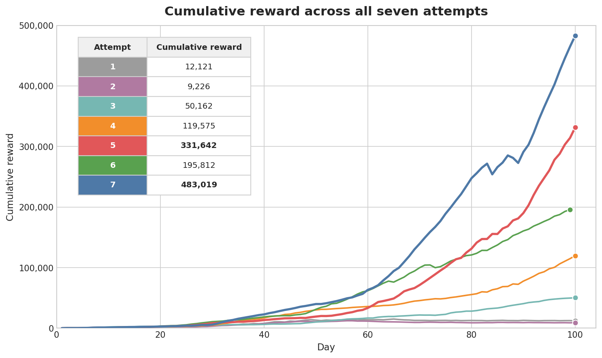

# Self-Improving Agent Networks: Getting Better at a Task Without Changing a Single Weight

AI agents are already capable of a great deal on their own. We wanted to see how far that can go. We're looking to build one that runs a business, an agent system that invents ideas, tests them, backs the ones that hold up, and is judged on the one thing it can't fake: does it make money? The long game is bigger: a system that reinvests what it earns into new ventures and eventually runs the whole portfolio itself, all of that by using **neuro-san-studio**, our multi-agent framework. But a grand vision is easy to write down. Does it actually work?

We can't answer that on a real business with real money: the tuition would be ruinous, and most of the early lessons are ones a simulation could teach for free. What we needed was a **simulation world that reacts to your decisions**: somewhere an episode is cheap, repeatable, and honestly scored, where the business is knotty enough that the right move is genuinely unclear. So we went looking for a world simulator that fit, and found one.

You are handed an amusement park and one decision a day. Build a roller-coaster; hire a janitor; place a souvenir shop; pour cash into research. You commit a single move, the gates open, guests stream in, and by closing time the day's takings tell you how you did. Do that for a hundred days, one full episode, and earn as much reward as you can. That is **Mini Amusement Parks (MAPs)**, a business-simulation benchmark from Skyfall AI ([arXiv:2511.15830](https://arxiv.org/abs/2511.15830)), and it is genuinely hard: humans still beat the best LLM agents by roughly 10× on the **medium** difficulty we run, where only the cheapest attractions start unlocked and everything stronger is gated behind research. That gating forces a tricky balance: you have to spend on research, which pushes the park into losses in the short term but pays off later. These early foundation decisions compound over a hundred days, so a weak opening quietly caps how good the ending can get. In that way, it mirrors an actual business: every dollar a ride earns is capital to put back in, whether into a stronger ride, another shop, or more research. It's the same earn-and-reinvest loop behind our bigger vision, just scaled down to a single park. 

But there is a fundamental limit. Point an LLM (or a network of them) at MAPs, run it a hundred times with the same prompts, and the hundredth episode is no better than the first, sometimes worse. The model is non-deterministic, and each entire game is a hundred separate decisions. With no training to build on, a strong episode comes down to luck or the model's innate knowledge, not a strategy it tested and confirmed, and we don't even know whether the profits can be repeated. Either way, nothing improves across episodes: the model can neither identify which decisions worked nor carry them into the next episode. An LLM is frozen at training time, and so is any agent network built from one. A bigger model raises the starting point of every episode, but never lets the network improve *across* it.

So we built a **harness** around the models: deterministic scaffolding that turns a network of agents into a system that learns from its own episodes, keeps what works, and gets better with each episode, with no weight changes and no human in the loop. Built on neuro-san-studio, the system reached **the #1 spot on the AI leaderboard**.

Here is how it works.

---

## Implementation

### Running the park: the agent network

We don't point a single LLM at the game. The park is run by an **agent network** organized with AAOSA on neuro-san-studio, looping once per day across the hundred-day game. On each turn, a coordinator (the front-man) reads the park's current state and fans a query out, in parallel, to a set of **domain specialists**, one per vertical: rides, shops, staff, layout, research, and guest-survey analyst. Each specialist can read (but not edit) its own **strategy playbook** and the slice of park state relevant to its vertical, and from those it hands back two candidate actions for its area. The coordinator reads its own playbook, weighs the candidates against the strategy written there, and picks one action. Before the action gets fired, we run two deterministic gates to check if the proposal is valid or not.

The first gate is **`FinanceGate`**, a coded tool that does the arithmetic LLMs are unreliable at: the one-time build cost against the cash on hand, the daily operating cost, and whether the investment can still earn itself back in the days that remain, all computed from the game's economics tables, never estimated by a model. The player *proposes* an action; the gate returns a flat approve or reject.

The second gate, **`ProposeAction`**, checks the approved action against the game's rules *before the simulator advances at all* and writes the validated proposal to disk. If it's malformed or against policy, the environment is left untouched and the player is re-prompted with the reason. Only once it is written to the disk does the **loop** pick up that proposal and fire the step through **`ActionDispatcher`** coded tool. Keeping the gates and the firing in code, not the model, guarantees exactly one clean step per turn and spends no tokens on the mechanical work: the LLM is called only for the decision itself.

A loop that long could get expensive fast, seven agents a turn, a hundred turns, each otherwise dragging its whole history along. So every agent is wrapped in **middleware** that trims the chat back to just the new message each turn and caches the static system prompt so it isn't re-billed on every call. The player ends up *stateless by default*: it remembers nothing between turns except what the harness has written to disk. That keeps an episode cheap, and it forces a discipline the whole design leans on: the acting network has no private memory to hoard, so anything worth keeping has to be written down to disk where the rest of the system can read it, because the player isn't the only network at work.

All of that is enough to *play* MAPs. None of it makes the next episode any better than the last.

### Three minds

To improve across episodes, the agent network has to reflect: record what worked, discard what didn't, and carry the rest into the next episode. We tried a few arrangements before settling on the current one. Our first version folded the reviewer into the same network as the player, and it bled tokens: the two halves talked past each other, turn after turn. Splitting them made each sharper about its own job, far cheaper to run, and let us control in code exactly when the reviewer runs. A second lesson followed: a single reviewer checking in every ten days kept patching symptoms with no sense of where the whole episode was headed, and it churned through too many strategies at once, swapping them out before any had the time it needed to prove out. So we split *reviewing* in two: a between-episodes **planner** that sets the direction, and a mid-episode **watcher** that course-corrects against it. We also limit the number of strategies tried at 3 in one episode.

So the result is three separate agent networks, each a mind with its own goal and its own timescale. No two share a conversation; to keep token use low, they coordinate only through plain-text files on disk:

- **The player.** The network described above - it plays one action a day from the context it's given, and never looks back.

- **The planner.** Runs before and after each episode. At **episode start**, it compares the **best episode ever recorded** against the most recent one, works out which strategies worked, which didn't, and what to carry forward, then writes the plan the next episode will follow: a day-phased checklist plus a short strategy brief for the coordinator and each domain specialist, along with up to three fresh strategies to trial. The player re-reads that plan every turn. At **episode end**, it does a thin close-out: promoting the trials that proved out and retiring the ideas that stopped paying off.

- **The watcher.** Runs every ten days, at days 10, 20, … 90 of the episode. It reads the episode's telemetry so far, diagnoses the reward trajectory, and logs small course-corrections (micro-trials) the specialists act on next turn, checking that the planner's strategies are actually landing without duplicating them. It also judges one thing: is this episode still worth finishing? If there's no plausible path to the target by day 100, it calls the episode doomed and the loop aborts it early instead of wasting days.

### Earning memory, and never losing it

Proposing plausible ideas is the easy part; the real work is making sure a good episode's gains survive a bad one. Everything so far happens *within* an episode. What happens *between* episodes is what actually compounds, and it comes down to three moves: keep what's proven, cut what's hopeless before it costs much, and always start the next episode from the best the system has ever managed.

Everything an agent knows for its own slice of the game lives in its **strategy playbook**: a plain-text file it reads at the top of every turn, one for each specialist and one for the coordinator. Each playbook has three parts.

#### Static documentation

The first part is the game's documentation and economics tables for that vertical: the cost, benefits, and rules of every action the agent can take. The rides table, for example, lists each ride and tier with its build cost, capacity, ticket cap, guest happiness and how long it takes to pay for itself. It comes straight from the [MAPs documentation](https://maps.skyfall.ai/) and never changes from episode to episode. The agents read it each day so they never have to guess or estimate the figures a decision depends on, and it is the same reference `FinanceGate` computes against, so the model's judgment and the code's arithmetic work from one source of truth.

#### Learned strategies

The second part is the strategy the system has worked out for that vertical, both what it has already proven and what it is currently testing. Proven rules are the ones confirmed in earlier episodes, like when a ride is worth upgrading a tier, or which shop to place first. They begin from a hand-written baseline, a read-only **seed**, and grow only as new rules are confirmed, each tagged with the episode it came from. They are read every turn and take priority over hunches.

Proposed strategies enter as a **trial**. The planner proposes up to three candidate strategies per episode, and because a profitable episode never tells you *which* of them earned the money (and a single good result might just be luck), each is written as a **falsifiable hypothesis** in three parts:

1. **A rule:** a general instruction the agents follow, not a one-off observation.
2. **A success condition:** a specific metric, a direction, and a **window** of days to check it over, long enough that one lucky or unlucky day can't fake the result.
3. **A failure condition:** the exact result that would prove the rule wrong.

A trial steers real decisions for the full 100-day episode, then at close-out it is judged against the deterministic log, never the model's own account, and by a different network than the one that made the calls: the **planner** network grades, not the player network. The verdict is one of three:

- **Confirmed** → written into the proven rules above.
- **Falsified** → dropped, and logged so it is never proposed again.
- **Inconclusive** → carried forward untouched, for another trial.

Every rule tried and every verdict is kept in an append-only **trial ledger** that is never wiped between episodes, so a falsified idea stays dead instead of coming back as a "new" proposal three episodes later.

#### The episode's plan and champion

The third part is the episode's marching orders, written fresh by the planner at the start of each 100-day episode and pinned at the top of every playbook: a short **strategy summary** (the direction for this episode, what the coordinator and each specialist should prioritize and what to avoid) and a day-phased **checklist** of roughly what the park should look like by day 10, 30, 60, and on. The player re-reads it every turn so it never loses the thread. It runs strictly forward: the plan is set at the start and does not change mid-episode.

Across episodes, though, the best plan is never thrown away. Every episode's plan is snapshotted to disk, and an episode that finishes clean and beats the best reward on record becomes the **champion**: the single best plan the system has produced. That champion is where every later episode starts, and it holds until a better episode beats it, so the progress a good episode makes is never lost.

The watcher guards the other direction. Alongside the micro-trials it logs mid-episode, it keeps judging how well an episode is going. A hopeless one just burns tokens and time on something that cannot reach the reward we want. And letting it run to the end can drag down the episodes that follow, throwing away hard-won progress over one or two bad strategies. So it grades the episode every ten days as on-track, underperforming, or doomed: in the first 50 days a doomed verdict takes two strikes before we pull the plug; later, one doomed verdict ends the episode at once. Once an episode is confirmed doomed, the runner stops spending tokens on it, fast-forwards to the end of the 100-day episode with empty `wait()` moves to book the loss cheaply, marks all of that episode's trials failed, and rolls back to the previous champion. The next episode then builds forward from that champion rather than from the wreckage, all as a plain file copy, with no model in the loop.

So the learned strategy and the episode's plan hold two different kinds of memory. The learned rules are durable, hard-won facts about what works, kept across every episode; the plan is one episode's coherent, step-by-step strategy, rewritten each time. Because they are separate, a doomed episode's plan can be thrown out and rolled back to the champion without a single hard-won rule going with it.

## Results

Getting there took real work up front: building the harness and engineering the prompts. But the seven episodes themselves ran hands-off: same models, same code, no human touching a prompt between them. The only thing that changed from one to the next was the memory the network wrote for itself.

That's a **nearly 40× climb from the first episode to the seventh** (12,121 → 483,019), with no weight updates and no human touching a prompt in between. The biggest jumps come once the system locks in its core money-making strategy: build up rides, shops, and staff early, then spend on research to unlock higher-tier rides that pull in bigger crowds and lift the park's rating, neither hoarding cash nor over-investing but striking a balance, all written down where it can't forget it again. Below is a comparison of the 3rd and 7th episodes:

The early episode (episode 3) spends little and places few rides, so it actually looks richer at first, with more cash in the bank, but it never builds the capacity to grow: it unlocks only the first research tier (blue), and only for a single ride, and its reward stalls near $50k. The best episode (episode 7) does the opposite. It runs at a loss early to pour money into research, works its way through every tier (blue, then green, then red), and keeps reinvesting until the upgrades compound. In the final stretch it is clearing roughly $15,000 to $20,000 in reward a day, finishing near $483k.

And the climb isn't a straight line, which is the part worth watching. Episode 5 set a high-water mark of 331,642; episode 6 then slid all the way back to 195,812. That's what genuine exploration looks like, and it is the exact case the champion mechanism was built for: episode 7 didn't inherit episode 6's stumble. It planned from episode 5's preserved peak, skipped the dip entirely, and came back with a new record of 483,019. The system still hasn't caught human performance (it's climbing, not arrived), but a recovery like that is the clearest sign yet that it's the memory doing the work, not luck.

## Conclusion

We came to MAPs to answer a narrow question: can a neuro-san-studio agent network actually learn to run something profitable? It's a first step toward the much larger one behind this whole project: a system that generates and runs businesses on its own, funding new ventures with what it earns and, in time, managing the whole portfolio itself. A park is not a business, research is not real funding, and a benchmark is not the world. And this is a proof of concept, not a proof. Still, watching the same models, untouched, climb nearly 40× on the strength of the harness around them is the first concrete sign that the larger version is worth chasing.

## Future scope

Our system already leads every other AI on the benchmark, but it's still well short of human performance; closing that gap is the immediate goal.

But MAPs is only a game. The bigger aim is to take what we learned here to the real world, turning the same loop into a general way to *build* agent networks on neuro-san-studio out of the same three pieces: an agent network, a consultant, and a test framework. Neuro-san-studio's agent-network designer generates a candidate network along with a matching test suite, vibe-coded from a plain-language description of the task. The tests run, the consultant reads the results and rewrites the agent prompts, and the cycle repeats until enough tests pass. It's the same self-improving loop we used here for park strategies, pointed this time at the agents themselves.

